# 🛒 OneCart

OneCart is a full-stack e-commerce web application where users can browse products, search and filter products, manage their cart and wishlist, and place orders.

The project also includes an admin panel for managing products, users, and orders.

## ✨ Features

### Customer
- User registration and login
- JWT authentication
- Browse products
- Search products
- Filter products by category
- Product details
- Add products to cart
- Wishlist
- Place orders
- View order history
- Responsive design

### Admin
- Admin dashboard
- Manage products
- Manage users
- View orders
- Update order status
- View sales/revenue information

## 🛠️ Tech Stack

### Frontend
- Next.js
- React
- JavaScript
- Tailwind CSS
- Lucide React

### Backend
- FastAPI
- Python
- Pydantic
- JWT Authentication

### Database
- MongoDB

### 📸 Screenshots

👤 Authentication

🔐 Login Page

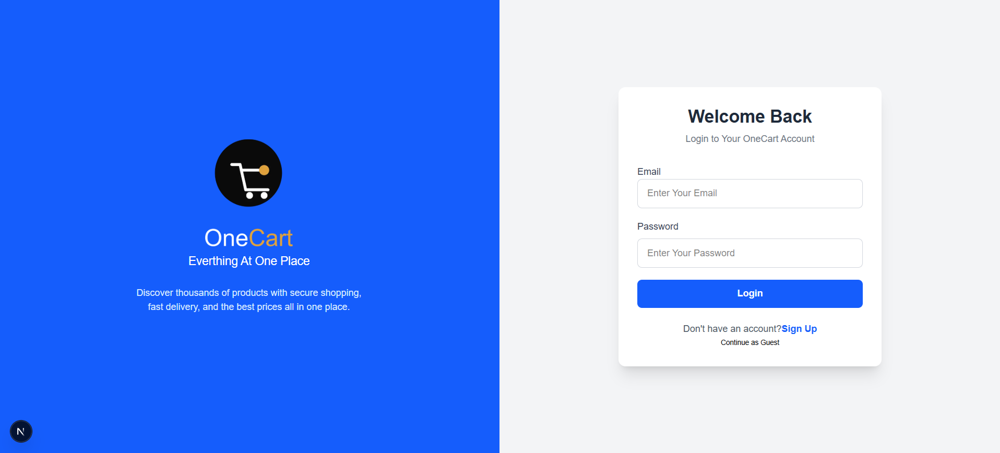

📝 Signup Page

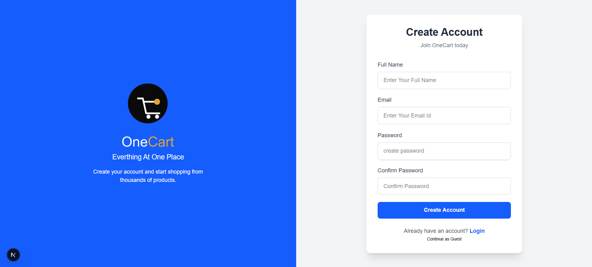

🏠 Customer Pages

🏠 Home Page

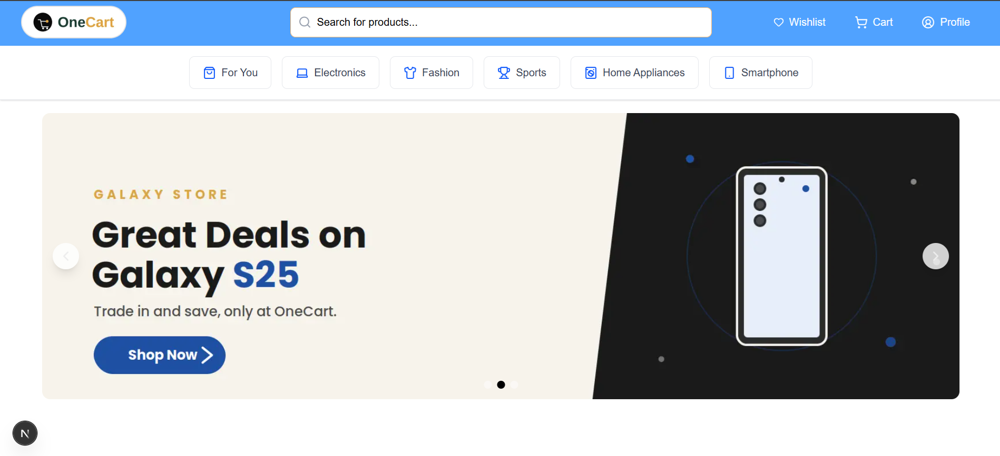

🛍️ Products

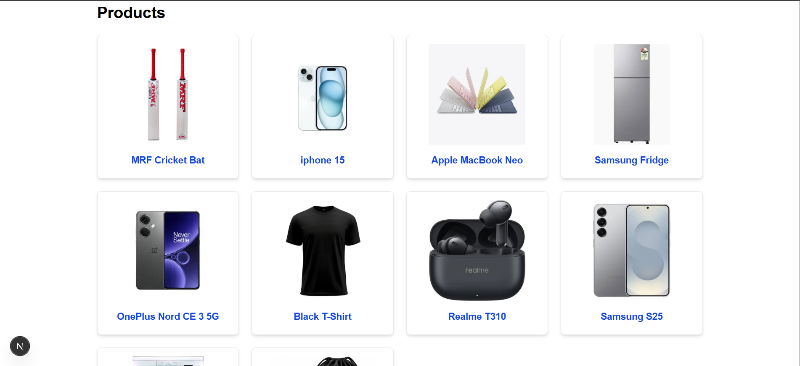

📦 Product Details

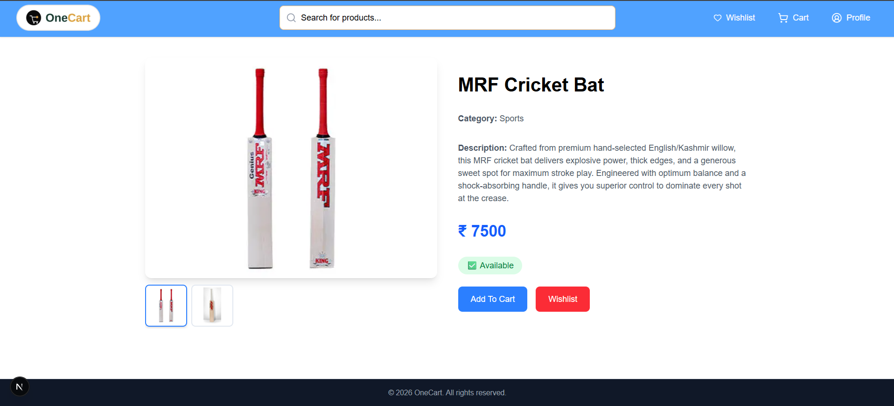

🛒 Shopping Cart

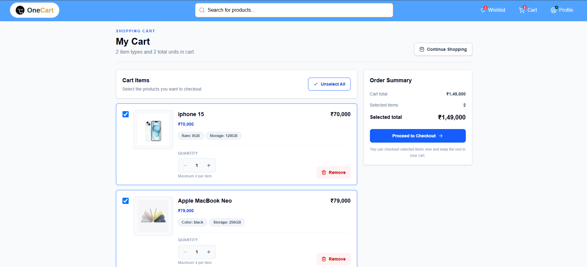

❤️ Wishlist

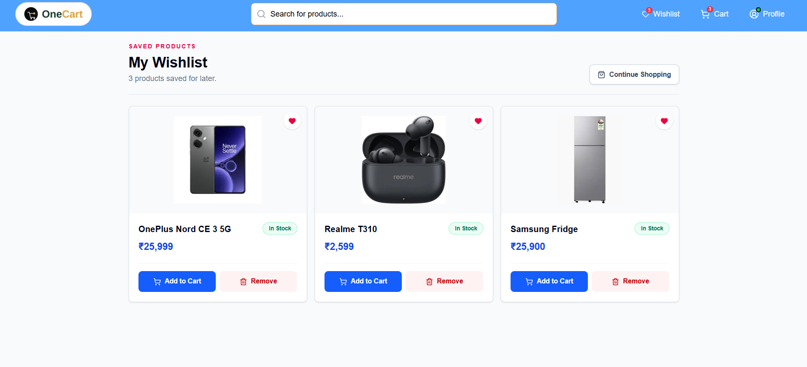

👤 User Profile

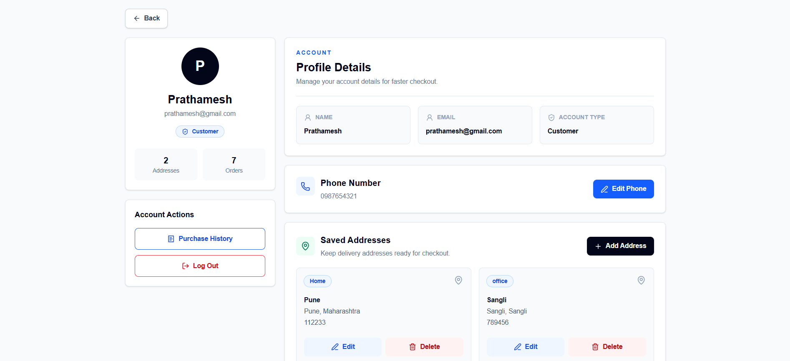

📋 My Orders

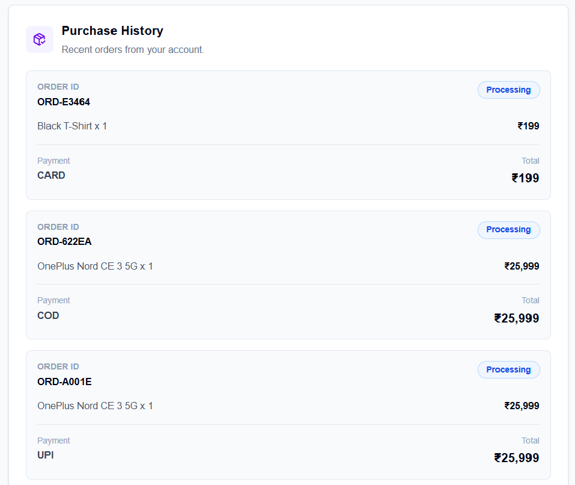

⚙️ Admin Panel

📊 Admin Dashboard

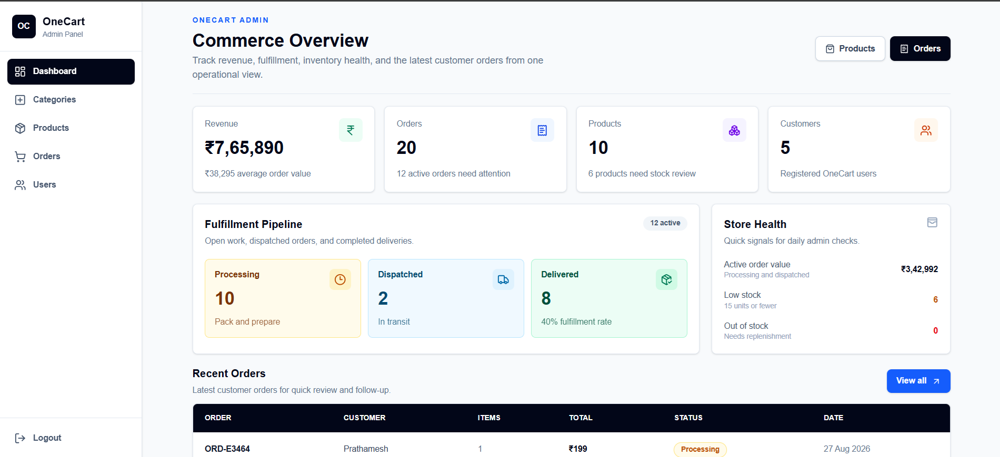

🏷️ Manage Categories

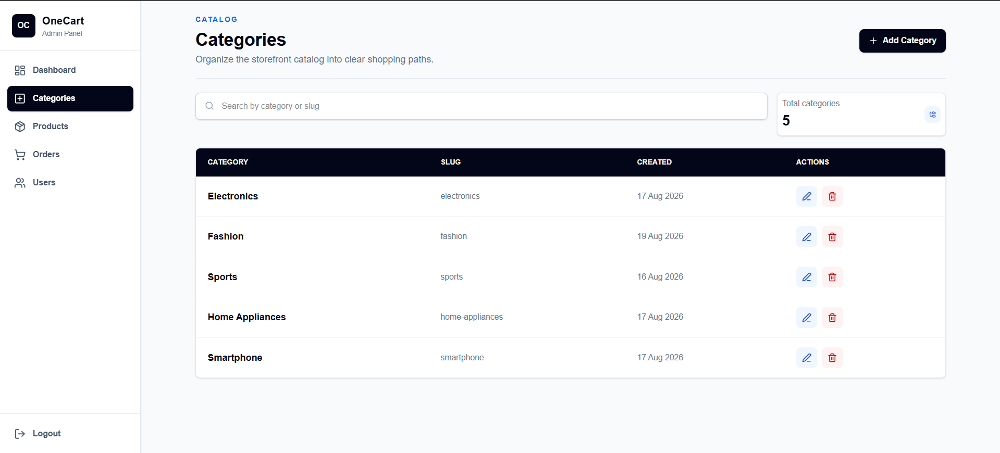

📦 Manage Products

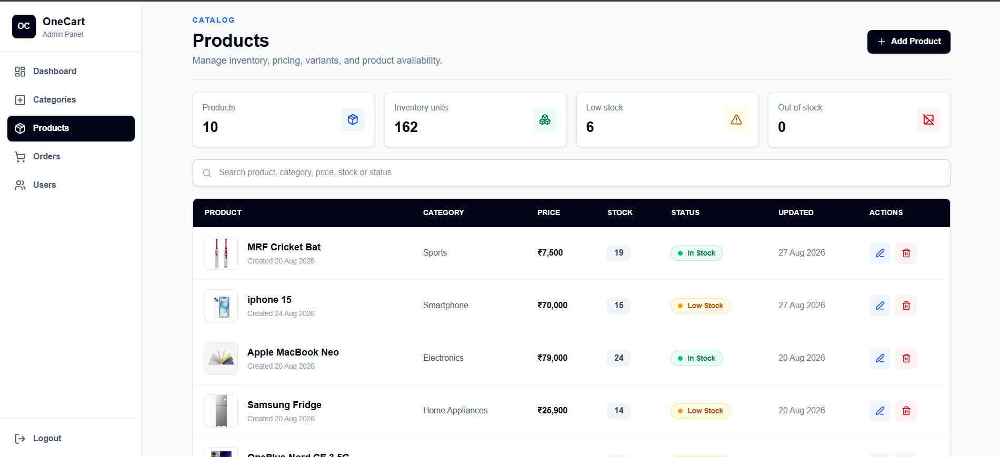

🛒 Manage Orders

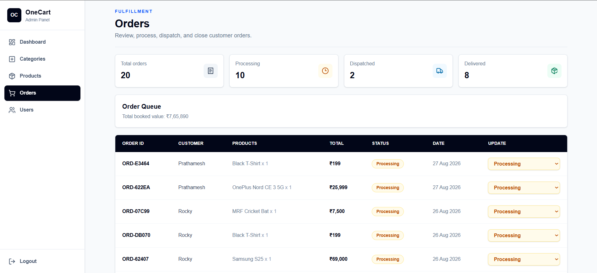

👥 Manage Users

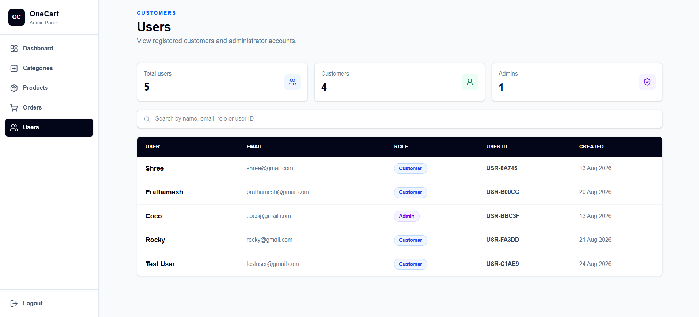